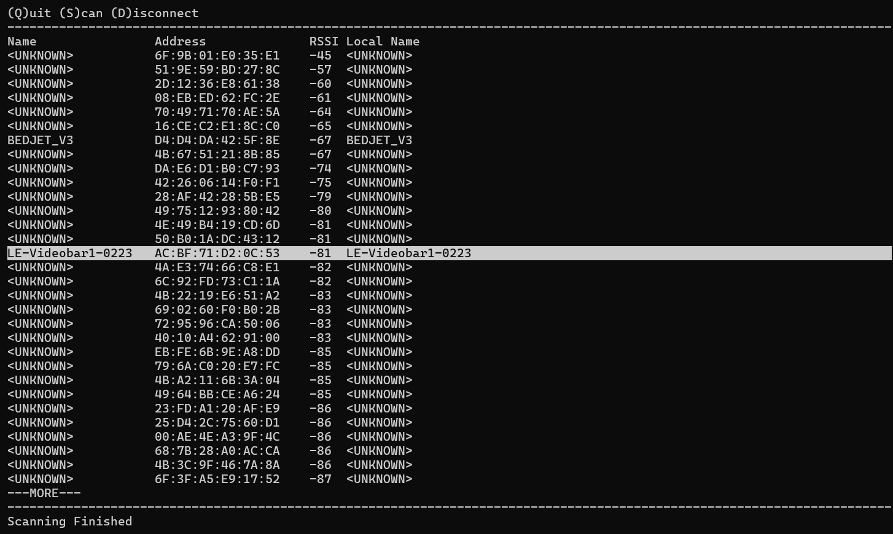
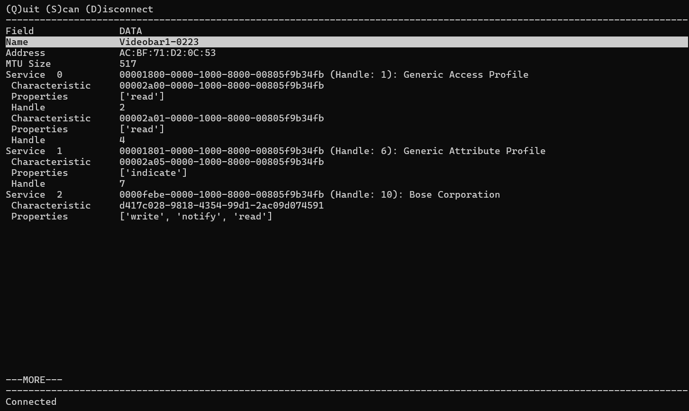

# BLEer
A simple utility for exploring BLE devices.

# Usage
Install the 3rd party libraries `pip install -r requirements.txt`

Run using `python bleer.py`

Scan for devices with `s`

Use the arrow keys or pgup and pgdn to scroll to highlight the desired device and `<enter>` to connect to the device.

Once connected use the arrow keys or pgup and pgdn to explore the services.

Disconnect from a device using `d`

Quit with `q`

